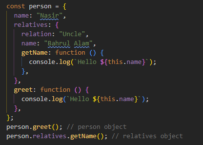
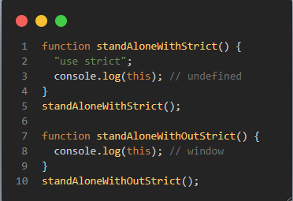
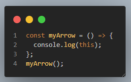
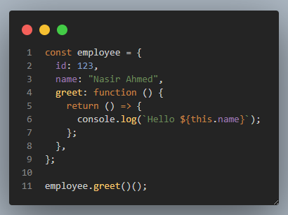
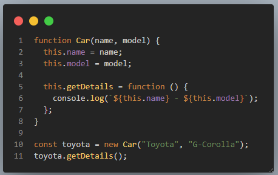

### 1. Create a table of two columns, situation and value. Now add the rows for every situations and the value of this in that situation. Please cover the following situations

| Situation                                            | Value                                                                                                                           |
| ---------------------------------------------------- | ------------------------------------------------------------------------------------------------------------------------------- |
| At the Global                                        | At the global object, `this` always refers to the `window` object whether it is in strict mode or not.                          |
| Inside an Object Method                              | If the method is a standard JavaScript function (not an arrow function), `this` refers to **whoever called it at that moment**. |
|                                                      |                                                                                                  |
| Inside the Standalone non-Arrow Function             | In strict mode, `this` is `undefined`; otherwise it refers to the `window` object.                                              |
|                                                      |                                                                                                |
| Inside an Arrow Function (standalone)                | Parent (lexical) scope.                                                                                                         |
|                                                      |                                                                                                |
| Inside an Arrow Function (as object method)          | Parent (lexical) scope — **not the object itself**.                                                                             |
|                                                      |                                                                                                |
| Inside an Object Created with a Constructor Function | `this` refers to the **newly created object instance**.                                                                         |
|                                                      |                                                                                                |

### 2. What is the problem here? Fix it to log the correct name and explain the fix.

```
    const user = {
    name: "tapaScript",
    greet: () => {
        console.log(`Hello, ${this.name}!`);
      },
    };
    user.greet();
```

#### Ans: `greet()` is an object method. Since the method is arrow function and arrow function doesn't have it's own `this`, it will refer to its lexical parent scope. In this case `greet()` function's scope is `user` object and its parent scope is `window`. `window` doesn't have `name` property. So `this.name` is `undefined`. To fix this, use standard js function.

```
const user = {
  name: "tapaScript",
  greet: function () {
    console.log(`Hello, ${this.name}!`);
  },
};

user.greet();
```

### 3. Can you explain what is the problem here and fix the issue to log the correct name?

```
  const obj = {
    name: "Tom",
    greet: function () {
      console.log(`Hello, ${this.name}!`);
    },
  };
  const greetFn = obj.greet;
  greetFn();
```

#### Ans: We are assigning `obj.greet` function to a variable. `greetFn` is the variable name in this case. So `greetFn` is nothing but a standard function definition. Standard function in non strict mode point to the `window` object. Since `window` object doesn't have name property, therefore name is `undefined`. If we call greetFn() with explicit context then we can show the correct name.

```
  // Fix - 1
  const obj = {
    name: "Tom",
    greet: function () {
      console.log(this);
      console.log(`Hello, ${this.name}!`);
    },
  };
  const greetFn = obj.greet;
  greetFn.call(obj);

  // Fix - 2
  const obj = {
    name: "Tom",
    greet: function () {
      console.log(this);
      console.log(`Hello, ${this.name}!`);
    },
  };
  const greetFn = obj.greet.bind(obj);
  greetFn.();
```

### 3. What is the problem with the following code? Why isn't it logging the name correctly?

```
  const user2 = {
    name: "Alex",
    greet: function () {
      function inner() {
        console.log(`Hello, ${this.name}!`);
      }
      inner();
    },
  };

  user2.greet();
```

#### Ans: inner function is invoking without any context. So this.name is undefined in this case. If we have to log the correct name we can convert it to arrow function. The idea is arrow function does't have it's own this. It refer to its lexical parent scop. In this inner() function will find user2 object as its lexical parent scope.

```
const user2 = {
  name: "Alex",
  greet: function () {
    const inner = () => {
      console.log(`Hello, ${this.name}!`);
    };
    inner();
  },
};

user2.greet();
```
